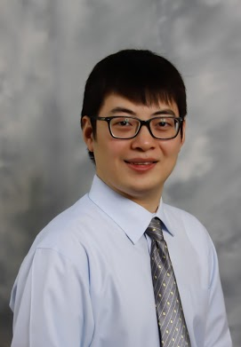

<h4>About me</h4>

  

     

        
        	

    

  
    
        

            Hao Harry Feng 
            <a href="http://epbiwww.case.edu/">Department of Population &amp; Quantitative Health Sciences</a> 
            <a href="https://case.edu/medicine/">School of Medicine</a> 
            <a href="https://case.edu/">Case Western Reserve University</a> 
            10900 Euclid Avenue 
            SOM / Room G82T 
            Cleveland, OH 44106 
            USA  

            

            Email: <code>hxf155@case.edu</code> 
            Phone: 216-368-5510 
             <a href="https://scholar.google.com/citations?user=YGFvJjwAAAAJ&hl=en">Google Scholar</a> 
            <a href="https://github.com/haoharryfeng">GitHub</a> 
      
        

       
        

    

---

I am is a tenure-track assistant professor in biostatistics at the 
[Department of Population &amp; Quantitative Health Sciences](http://epbiwww.case.edu/)
at Case Western Reserve University School of Medicine and an associate member at [Case Comprehensive Cancer Center (CCCC)](https://case.edu/cancer/).

I obtained my Ph.D. degree in Biostatistics from [Emory University](https://www.sph.emory.edu/departments/bios/index.html) under the guidance of
professor [Hao Wu](http://www.haowulab.org/). Before that, I received my MSPH degree in biostatistics from Emory University (2013) and my BS degree 
from the [University of Science and Technology of China](https://en.ustc.edu.cn/) (2011). 

I am a statistician focusing on problems in bioinformatics. Developing statistical methods for high-throughput _omics_ data is a 
major component of my research. In the past, I utilized epigenomics data to define biomarkers, classify cancer 
subtypes and predict disease in cell-free DNA. I also collaborate closely with physicians 
and wet-lab researchers on various projects including cancer, virus, trauma, and neurodegenerative disease studies.

[curriculum vitae ]({{ BASE_PATH }}/assets/broman_cv.pdf) 
[orcid](https://orcid.org): [0000-0003-2243-9949](https://orcid.org/0000-0003-2243-9949) 

