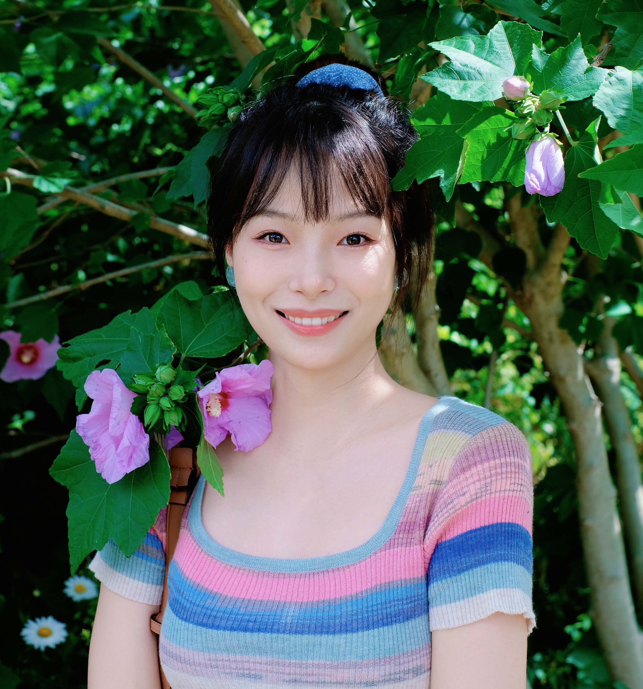
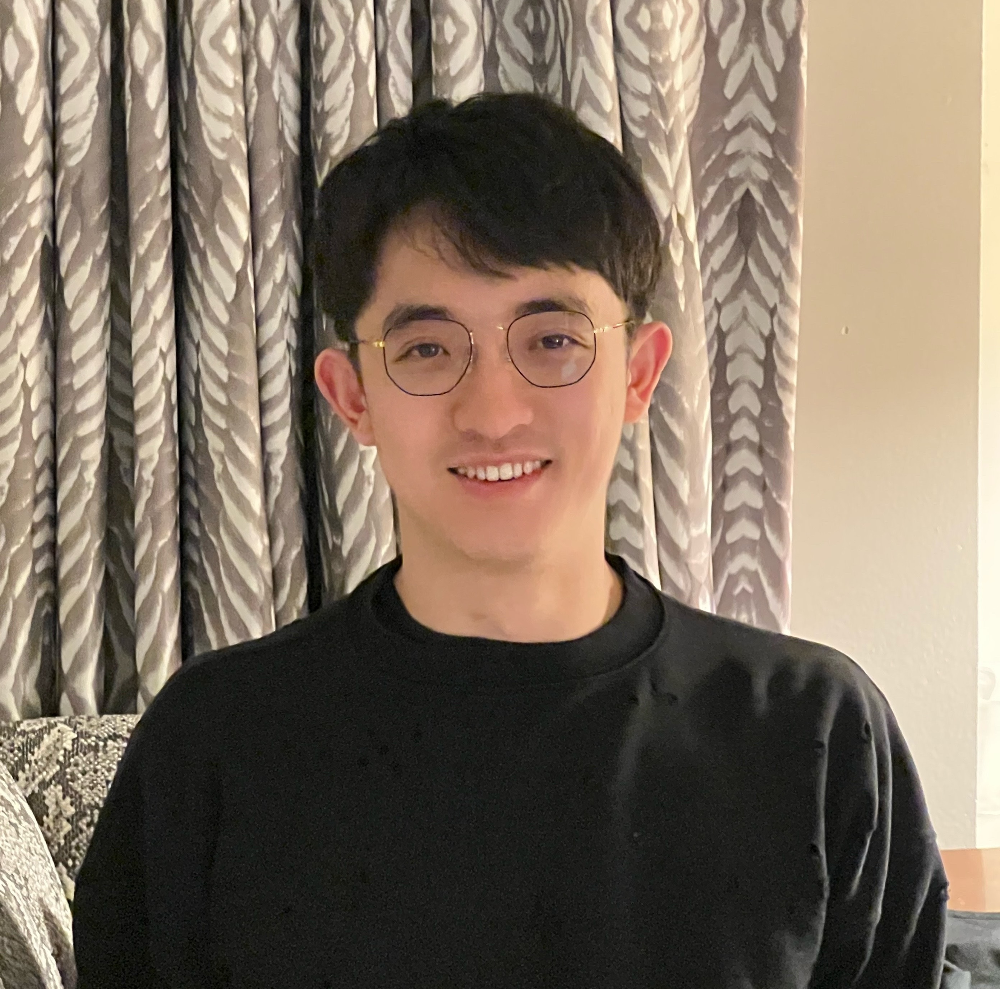

### PI

  

     

        
        	

   
    
        

            <b>Hao 'Harry' Feng</b> 
			Assistant Professor  
      <a href="https://hfenglab.org/PI.html">About the PI</a> 
   
   
        

    

---

### Biostatistician

  

     
       
     
            
        	

    

  
    
        

            <b>Wen Tang</b> 
            Biostatistician Research Associate  
            
    <a href="https://scholar.google.com/citations?user=FHi6G20AAAAJ&hl=en">Google Scholar</a>     
       
        

    

---
### PhD Students

  

     

            
        	

    
        

            <b>Daoyu Duan</b> 
            Ph.D. student in Epidemiology and Biostatistics  
         <a href="https://scholar.google.com/citations?user=wEgimXkAAAAJ&hl=en">Google Scholar</a> 

         <a href="https://www.linkedin.com/in/daoyu-duan-9b2571130/">LinkedIn</a> 
    
   
       
        

    

---

  

     

            
        	

    
        

            <b>Guanqun (Leslie) Meng</b> 
            Ph.D. student in Epidemiology and Biostatistics  
         <a href="https://scholar.google.com/citations?user=n-294NQAAAAJ&hl=en">Google Scholar</a> 

        <a href="https://www.linkedin.com/in/lesliemeng">LinkedIn</a> 
        

       
    

---

### Undergraduate Student

  

     

            
        	

    
        

            <b>Dounia Ouzidane</b> 
            Undergraduate student in statistics  
         <a href="http://www.linkedin.com/in/douniaouzidane">LinkedIn</a> 
    
   
       
        

    

---

<!--
### Visiting Students

  

     

        
        	

    

  
    
        

            <b>Sijia He</b> 
            MS Student in Biostatistics   
            Department of Biostatistics, University of Michigan School of Public Health  
      
       
        

    

---

  

     

        
        	

    

  
    
        

            <b>Aditi Singh</b> 
            Graduate Student   
            Center for Molecular Medicine and Genetics, Wayne State University  
      
       
        

    

---

-->

### Lab Alumni

            <b>Sijia He</b> 
            CWRU undergraduate student (2018-2022)   
            Current position: MS Biostatistics student at University of Michigan   
      
    

