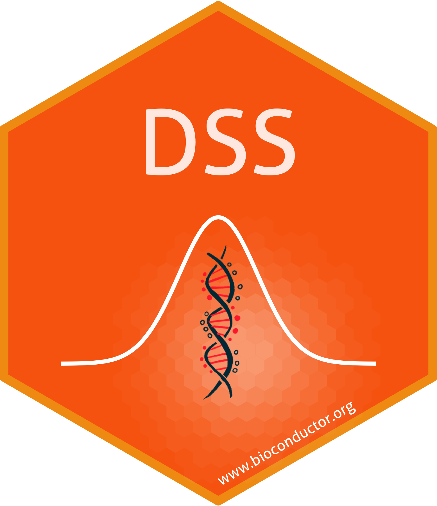
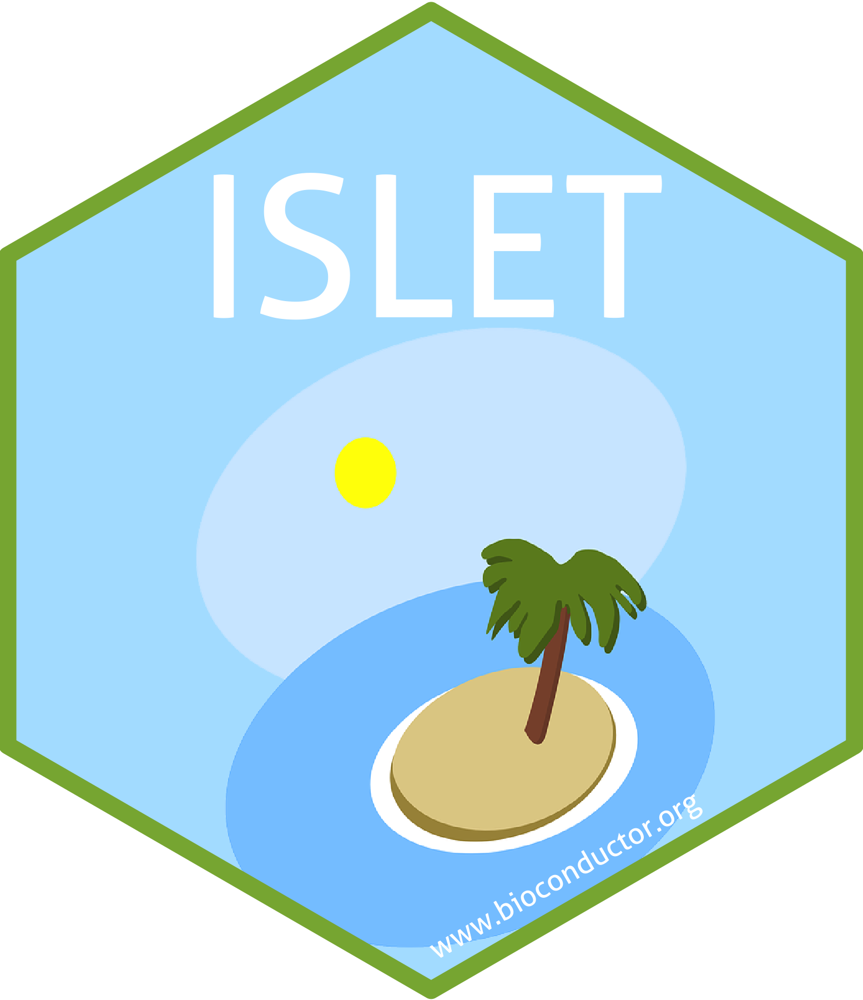

I develop and maintain freely-available, open-source software packages in R/Bioconductor/CRAN/GitHub to analyze high-throughput genomics 
data. They are available through [R cran](https://cran.r-project.org/), [Bioconductor](https://www.bioconductor.org/) 
or [GitHub](https://github.com/haoharryfeng). 

  
  
 	
 	 	
 	 	 	 	
<!--   		 	-->

---------------

- <a style="color: white;" class="btn btn-primary" href="https://bioconductor.org/packages/release/bioc/html/DSS.html">DSS</a> 
  <a style="color: black;" class="btn" href="http://bioconductor.org/packages/stats/bioc/DSS/">Usage Stats</a> 
   
  (**D**ispersion **S**hrinakge for **S**equencing): differential analysis for 
  count-based sequencing data. It detectes differentially expressed genes (DEGs) from RNA-seq, and differentially methylated regions (DMRs) from 
  bisulfite sequencing (BS-seq) data. DSS is one of the mostly cited packages for DMR detection, with >10,000 downloads each year. Available on [Bioconductor](https://bioconductor.org/packages/release/bioc/html/DSS.html). Associated publications on [**Nucleic Acids Research**](https://academic.oup.com/nar/article/42/8/e69/1074350), [**Nucleic Acids Research**](https://academic.oup.com/nar/article/43/21/e141/2468097), and [**Quantitative Biology**](https://onlinelibrary.wiley.com/doi/10.1007/s40484-019-0183-8). 

- <a  style="color: white;" class="btn btn-primary" href="https://www.bioconductor.org/packages/ISLET/">ISLET</a>
  <a style="color: black;" class="btn" href="http://bioconductor.org/packages/stats/bioc/ISLET/">Usage Stats</a> 
   
  ISLET (**I**ndividual-**S**pecific ce**L**l typ**E** referencing **T**ool) can deconvolute mixture samples and obtain the individual-specific and cell-type-specific reference panels, for repeatedly measured subjects' bulk data. Available on [Bioconductor](https://www.bioconductor.org/packages/ISLET/). Associated publications on [**Genome Biology**](https://genomebiology.biomedcentral.com/articles/10.1186/s13059-023-03014-8) and [**Genome Medicine**](https://genomemedicine.biomedcentral.com/articles/10.1186/s13073-024-01338-z).
				       
- <a  style="color: white;" class="btn btn-primary" href="https://www.bioconductor.org/packages/magpie/">magpie</a>
  <a style="color: black;" class="btn" href="http://bioconductor.org/packages/stats/bioc/magpie/">Usage Stats</a> 
   
  **magpie** (**m**6**A** **g**enome-wide **p**ower **i**nf**e**rence) can perform statistical power analysis for the RNA methylation (m6A MeRIP-seq) study. It evaluates FDR, FDC, power, and precision under various study design parameters, including sample size, sequencing depth, and testing method. It can also produce power evaluation results into .xlsx files and generate power figures. Available on [Bioconductor](https://www.bioconductor.org/packages/magpie/). Associated publication on [**PLOS Computational Biology**](https://journals.plos.org/ploscompbiol/article?id=10.1371/journal.pcbi.1011875) 

- <a  style="color: white;" class="btn btn-primary" href="https://www.bioconductor.org/packages/cypress/">cypress</a>
  <a style="color: black;" class="btn" href="http://bioconductor.org/packages/stats/bioc/cypress/">Usage Stats</a> 
   
  **cypress**  is the first experimental design and statistical power evaluation tool in cell-type-specific Differential Expression analysis. This tool can reliably model purified cell-type-specific (CTS) profiles, cell-type compositions, biological and technical variations, offering a high-fidelity simulator for bulk RNA-seq convolution and deconvolution. cypress conducts simulation and evaluates the impact of influencing factors, to help researchers optimize experimental design and conduct power analysis. Associated publication on **Bioinformatics** (URL pending).

- <a  style="color: white;" class="btn btn-primary" href="https://bioconductor.org/packages/NeuCA/">NeuCA</a>
  <a style="color: black;" class="btn" href="http://bioconductor.org/packages/stats/bioc/NeuCA/">Usage Stats</a> 
   
  (**Neu**ral-network based **C**ell type **A**nnotation): R/Bioconductor package for single-cell RNA-seq data cell type annotation, using neural-network approaches. NeuCA is flexible and adjust the classification method it will adopt, depending on cell types' correlation level. Available on [Bioconductor](https://bioconductor.org/packages/NeuCA/). Associated publications on [**Scientific Reports**](https://www.nature.com/articles/s41598-021-04473-4) and [**Bioinformatics**](https://academic.oup.com/bioinformatics/article/38/8/2361/6530279).
           
- <a  style="color: white;" class="btn btn-primary" href="https://CRAN.R-project.org/package=InfiniumPurify">InfiniumPurify</a>  
  R CRAN package for the estimation and adjustment for tumor purity in cancer methylation data analysis, available on [R CRAN](https://CRAN.R-project.org/package=InfiniumPurify). Associated publications on [**Bioinformatics**](https://academic.oup.com/bioinformatics/article/33/17/2651/3796398) and [**Genes &amp; Diseases**](https://www.sciencedirect.com/science/article/pii/S2352304218300163). 
		    
- <a  style="color: white;" class="btn btn-primary" href="https://github.com/haoharryfeng/cfDNAmethy">cfDNAmethy</a>  
  Reference-free and reference-based models for disease prediction by cell-free DNA methylation, available on [GitHub](https://github.com/haoharryfeng/cfDNAmethy). Associated publication on [**Briefings in Bioinformatics**](https://academic.oup.com/bib/article/20/2/585/4973009). 

